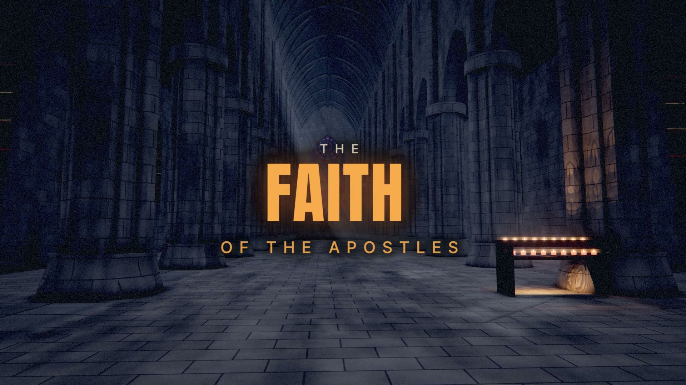

# The Faith of the Apostles

An Orthodox Christian song and code-rendered lyric film about the faith handed down from the Apostles.



[Listen and watch at TechnoChristianity](https://technochristianity.com/music/) · [Watch the official video](https://www.youtube.com/watch?v=Ilco2wMNuHU) · [Download the song and video](https://github.com/omiron33/faith-of-the-apostles/releases/tag/v3.0.0) · [TechnoChristianity on YouTube](https://www.youtube.com/@technochristianity)

Built with the Ark engine: https://github.com/omiron33/ark-video-studio, the engine that made this video.

The v3 film runs **4:41**, at **1920 × 1080 / 60 fps**. Its 38 scenes combine GPU shaders, a reconstructed church interior, procedural materials and typography aligned to the recording. The source includes the deterministic rendering runtime used by these scenes, with a portable command-line interface.

## Quick start

Install Node.js 22 or later, Google Chrome and FFmpeg (`ffmpeg` and `ffprobe` on your PATH), then:

```sh
npm ci
npm run validate
npm run still -- --scene s00-title --time 4 --samples 2
```

The still appears in `out/portable/stills/`. No recording or downloaded model is needed for this title scene. Set the `CHROME` environment variable if Chrome is installed outside the platform's usual location.

To render scenes inside the Church of the Savior on Spilled Blood:

```sh
npm run assets
npm run still -- --scene s13-holy --time 101 --samples 2
```

The asset command installs a pinned public model package and verifies every file's SHA-256. Its original credits accompany the download. All visible church materials are drawn procedurally for this film.

For the complete film, place the original 48 kHz stereo recording at `media/song.wav` and run:

```sh
npm run render -- --draft
npm run render
```

Full rendering is GPU intensive and can take hours. The draft uses 30 fps and two samples; the final uses 60 fps, 32 picture samples and 16 lyric samples. Scenes are rendered one at a time and completed outputs are cached. See [rendering](docs/RENDERING.md) for scene clips, dependencies and limitations.

## Source layout

- `film.json` — scene order and timings.
- `scenes/` — one picture module and one lyric module per scene.
- `lib/` — worlds, camera shots, procedural materials and typography.
- `data/` — aligned words, measured musical timing and the pinned model manifest.
- `renderer/` — deterministic browser rendering and local FFmpeg encoding.
- `tools/` — rendering, validation and optional timing utilities.
- `releases/v3.json` — published master, web derivative and source-audio fingerprints.

[Scene architecture](docs/AUTHORING.md) · [Visual notes](docs/BRIEF.md) · [Credits and licenses](docs/CREDITS.md)

## License

Source code is released under the [MIT License](LICENSE). Fonts retain their SIL Open Font License notices. Downloaded model assets retain their individual licenses and credits. The song recording and completed film are separate media releases; the source-code license does not grant rights to redistribute those recordings.
